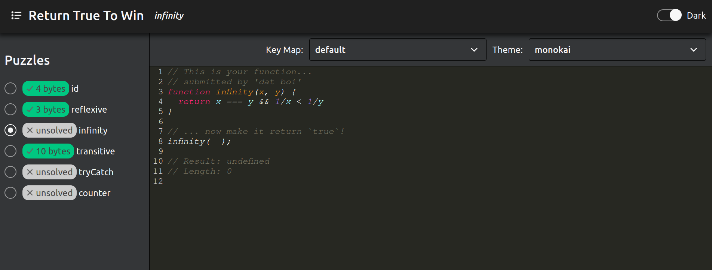

# Return true to win

This is a clone of the great online game [return true to win](https://alf.nu/ReturnTrue).
I made this because the website had been down for a while and I wanted to play that game.

## See it in action



## Using this project

#### Requirements

This project requires the following to be installed:

-   [NodeJS](https://nodejs.org/en/)
-   [`yarn`](https://yarnpkg.com/en/) (install with `npm i -g yarn` once you have node)
-   [MongoDB](https://docs.mongodb.com/manual/installation/)

#### Getting Started

If everything is working as expected, install all dependencies:

```bash
yarn # install dependencies, link packages in workspace together
```

And to start a local development server, run:

```bash
yarn start # Requires `tmuxinator` to be installed
```
